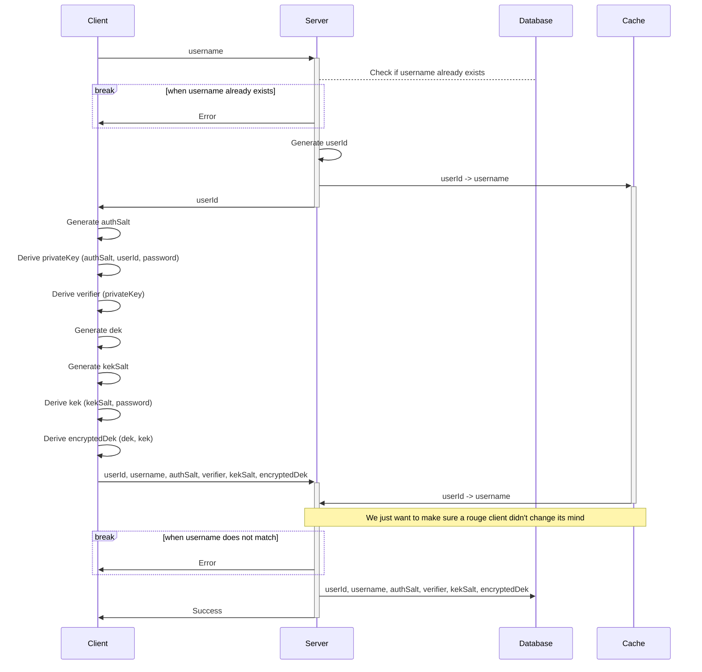
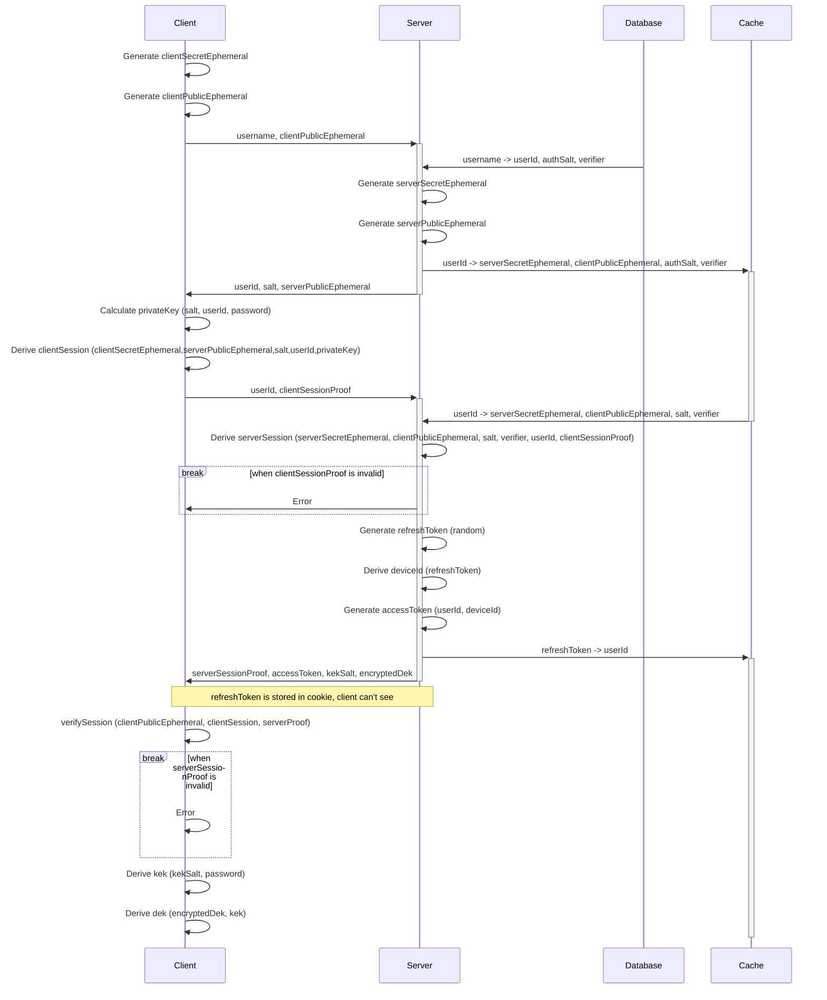
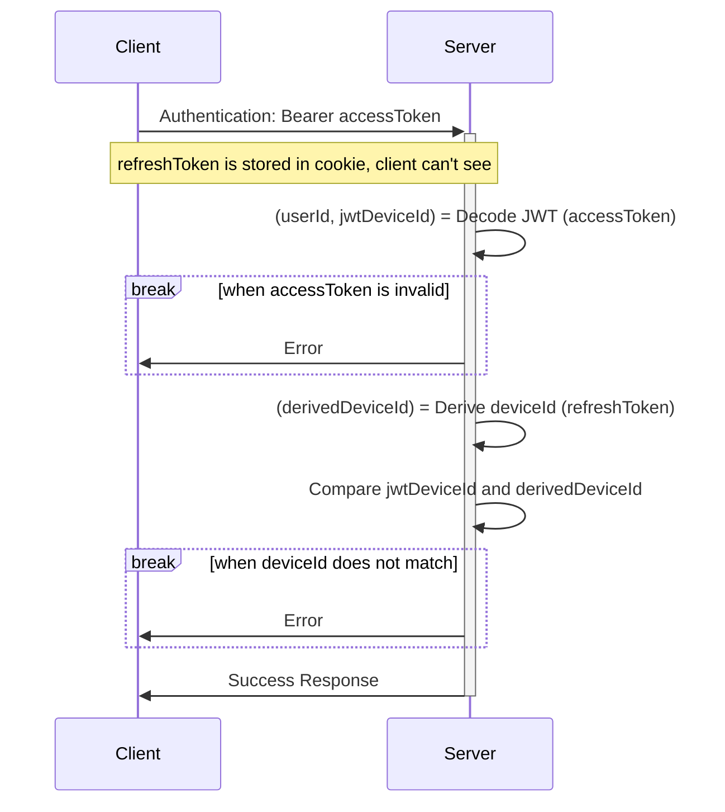
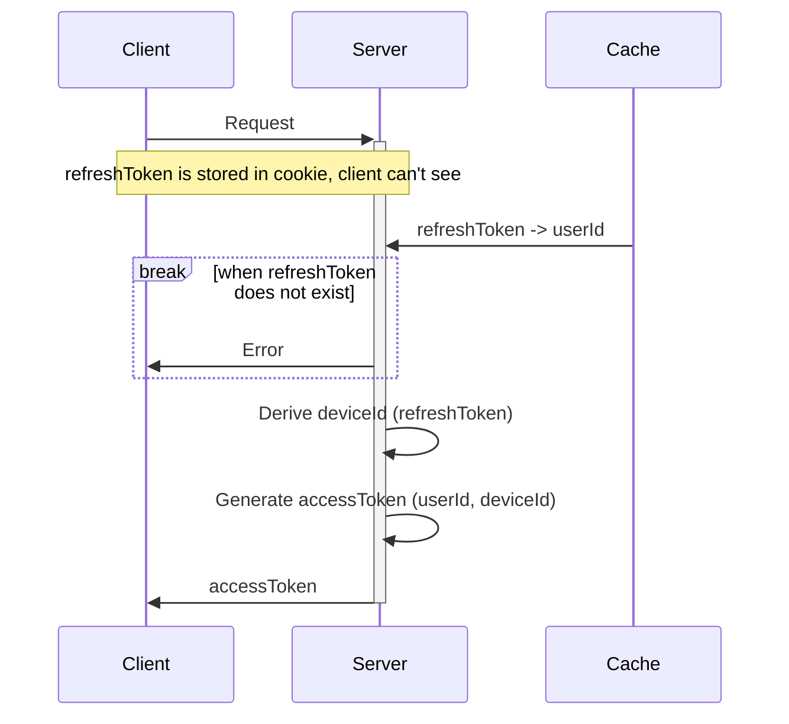

# time-app-test
This repository serves as a proof of concept for a secure time tracking application, 
demonstrating the implementation of a secure login flow and end-to-end data encryption.
The application is designed to provide complete offline functionality with optional real-time synchronization with a self-hosted server.

## Offline Functionality

To allow the application to function entirely offline, all *necessary* data is stored locally on the client device.

## Auth Flow

User authentication is handled using Secure Remote Password (SRP) protocol.

### Register

### Login

### Authenticated Endpoint

### Refresh

## Encryption Strategy

TODO

## Real-time Synchronization

TODO